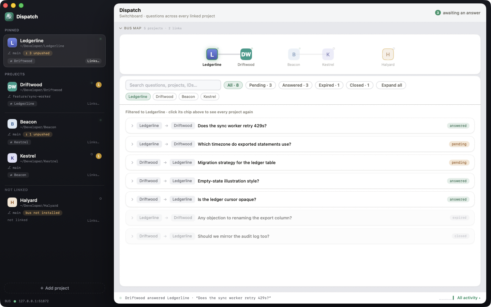

# Dispatch

[](LICENSE)


<p align="center">
  
</p>

<p align="center">
  <a href="https://awizemann.github.io/Dispatch/"><strong>Website</strong></a> &nbsp;·&nbsp;
  <a href="https://github.com/awizemann/Dispatch/wiki">Wiki</a> &nbsp;·&nbsp;
  <a href="#building-from-source">Build from source</a>
</p>

> A native macOS **switchboard between your local repos**. Link two repos as projects, and the Claude Code sessions you already run in each one — your own terminals, your own accounts — can ask each other questions and get answers, without you copy-pasting context back and forth.

## What Dispatch is

You're working in repo A. Something in repo B — a contract, a recent change, whether a field still exists — would answer a question you have. Normally that means switching terminals, re-explaining the situation to a second session, and carrying the answer back by hand.

Dispatch removes the copy-paste. You link the two repos as **projects** in the app; Dispatch merges one `dispatch` entry into each repo's `.mcp.json`; and the Claude Code session you start in each repo — the same way you always do, `claude` in your own terminal — picks up four extra tools that let it talk to the other project's session over a small HTTP server Dispatch hosts on `127.0.0.1`.

Dispatch is **not** an agent runner. It never spawns a process, never sees a transcript, holds no API key or account of yours, and has no work queue, no commit gate, and no QA pipeline. It only routes messages between sessions that already exist, that you already started.

## The four verbs

This is the entire agent-facing surface — four MCP tools, nothing else:

| Tool | What it does |
| --- | --- |
| **`list_projects`** | Lists the projects this one is linked to — the only projects `ask_agent` can reach. Each entry reports whether that project's session is connected right now, when it was last seen, and how many of its questions are sitting in your inbox. |
| **`ask_agent`** | Asks a linked project a question. If that project is connected and you pass `wait_seconds`, this waits and returns the answer inline; otherwise it returns `{status:"pending", question_id}` and the answer arrives on a later `check_messages`. |
| **`answer_agent`** | Answers a question addressed to *this* project, by `question_id`. Only the project a question was addressed to can answer it; an already-answered or expired question is refused, never silently overwritten. |
| **`check_messages`** | Reads this project's inbox: questions other projects have asked that are still waiting on an answer, plus the outcome of every question you asked that you haven't seen yet (answers, expiries). Each outcome is reported exactly once. |

A question is a question, not a task — the other session can't see your repo or your conversation, so each `ask_agent` call has to be self-contained.

## How the bus works

- **One localhost server.** Dispatch hosts a single HTTP server bound to `127.0.0.1` on a kernel-assigned port, for the whole app. Each linked project gets its own MCP endpoint on that server at `/bus/<token>`, where the token is a durable 128-bit id minted when the project was linked.
- **Identity is structural.** There's no header or argument to trust — reaching a project's route requires that project's token, which only exists in that repo's own `.mcp.json`. Project A cannot reach project B's endpoint by accident or by guessing.
- **The human is the consent boundary.** A link between two projects is a row created by a person, in the app, never by an agent. `list_projects` reports exactly the reachable set; an `ask_agent` call to anything outside it is refused. No link means no path — asks fail closed, not silently.
- **Delivery is durable, not live.** If the target session is connected and the caller passes `wait_seconds`, the ask long-polls for an inline answer. Otherwise the question waits in that project's inbox until its session calls `check_messages` — nothing wakes a session that isn't running.

### Installing the bus entry

Linking a project in Dispatch merges exactly one key into that repo's `.mcp.json`:

```json
{ "mcpServers": { "dispatch": { "type": "http", "url": "http://127.0.0.1:<port>/bus/<token>" } } }
```

The merge is value-faithful — your own MCP servers and any other top-level keys survive untouched, uninstalling removes only the `dispatch` key, and an existing `dispatch` entry that doesn't have the shape Dispatch writes is reported as a conflict rather than clobbered. This is the **only file Dispatch writes in a linked repo**, and the only key inside it Dispatch owns. Because the URL carries the project's bus token, treat a repo's `.mcp.json` as carrying a credential — don't commit it with the entry filled in.

### Optional: the check-messages nudge

`.mcp.json` gives a session the four tools; it doesn't make the session ever *look* at its inbox. Dispatch can optionally (opt-in, off by default) merge three hooks into a repo's own `.claude/settings.local.json` — `SessionStart`, `UserPromptSubmit`, and `Stop` — each a self-contained shell command that checks the local inbox count and, if non-zero, surfaces one line of context to the session. The hook commands never block or fail a session (every error is swallowed, the exit code is always clean), carry no interpolated project data, and never see message content — only a count.

## What Dispatch does not do

- Does not spawn, launch, or manage any agent process — the sessions on both ends are yours, started by you, in your own terminal.
- Has no work queue, task board, or commit gate.
- Runs no QA pipeline and reviews no code.
- Has no accounts, no cloud component, and makes no outbound network calls of its own — the bus is `127.0.0.1` only.
- Never reads message content outside the app's own Messages tab, where every question and answer routed through the bus is visible to you.

## Building from source

**Requirements:**

- macOS 14 (Sonoma) or later
- Xcode 27 (beta) or later, with Swift 6 strict concurrency
- The [Claude Code](https://claude.com/claude-code) CLI on your `$PATH` if you want to try the bus end to end — Dispatch never launches it for you, but you need it to *be* the sessions on either side

**Clone and build:**

```bash
git clone https://github.com/awizemann/Dispatch.git
cd Dispatch
./scripts/build.sh
```

`Dispatch.xcodeproj` is checked into the repo — no project generation step. `scripts/build.sh` is the same gate the project commits behind: a Release compile check first (`#Preview` bodies are type-checked in Release, so a Debug-only reference can break only Release and go unnoticed otherwise), then a Debug `build test` pass using Swift Testing (`@Suite` / `@Test` / `#expect`). Both stages use an isolated DerivedData path so they never collide with an Xcode GUI build.

To build a copy that won't fight an app you already have installed, use `./scripts/build-detached.sh` instead. To work in Xcode directly: open `Dispatch.xcodeproj`, scheme **Dispatch**, destination **My Mac**.

All build configurations sign with a Developer ID identity (see [`scripts/SIGNING.md`](scripts/SIGNING.md)); if you don't have that signing identity, point `DEVELOPMENT_TEAM` / `CODE_SIGN_IDENTITY` at your own team for local builds.

## Learn more

- [GitHub Wiki](https://github.com/awizemann/Dispatch/wiki) — build/link/first-ask walkthrough, architecture overview, and technical specification.
- [Website](https://awizemann.github.io/Dispatch/) — a shorter, visual tour.

## Contributing

PRs welcome — see [`CONTRIBUTING.md`](CONTRIBUTING.md) for build setup, architecture conventions, and how to open a pull request.

## License

MIT — see [`LICENSE`](LICENSE).
